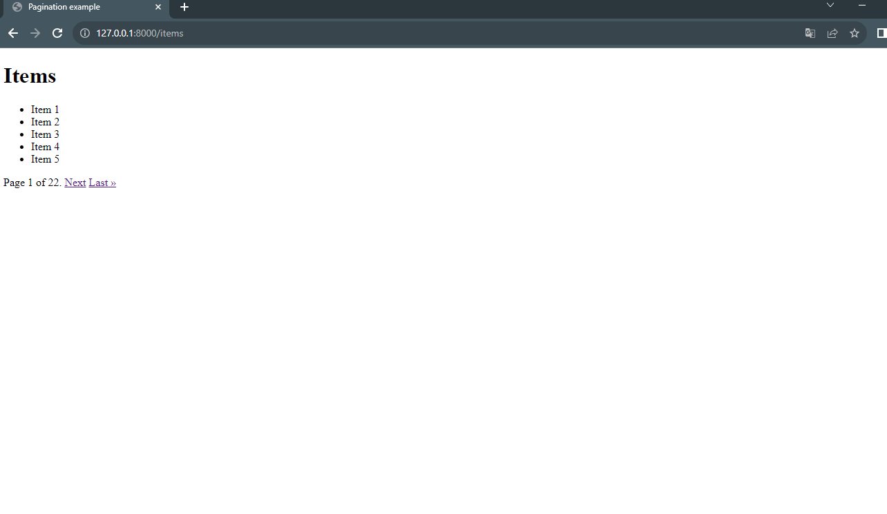

# Paginator for Django

## Introduction

Pagination is the process of breaking large chunks of data up across multiple, discrete web pages. Rather than dumping all the data to the user, you can define the number of individual records you want to be displayed per page and then send back the data that corresponds to the page requested by the user.

The advantage of using this type of technique is that it improves the user experience, especially when there are thousands of records to be retrieved. Implementing pagination in Django is fairly easy as Django provides a Paginator class from which you can use to group content onto different pages.

Pagination can come in different flavors depending on how it is configured by the developer. That said, in this tutorial, we'll look at how to include pagination with function and class-based views.

For more detailed info about Paginatro feel free to check [Paginator official page](https://docs.djangoproject.com/en/4.2/ref/paginator/)

## Followed steps:

Feel free to use this tutorial creating a Django project for testing and learning purposes, then transform and add it to your own projects.

1. **Install Django**

`pip install django`

2. **Create a Django project and app**

```
django-admin startproject pagination_example
cd pagination_example
django-admin startapp my_app
```

3. Define a model in your `myapp/models.py`

Creating data in a Django application involves defining models, migrating those models to create corresponding database tables, and then using the Django shell or management commands to create instances of those models.
```
from django.db import models

class Item(models.Model):
    name = models.CharField(max_length=100)

    def __str__(self):
        return self.name
```
4. Create database Tables(Migrate)
```
python manage.py makemigrations
python manage.py migrate
```

4. **Create some data using Django shell**

`python3 manage.py shell`

In the Django shell terminal:

Within the Django shell, you can create instances of the Item model (or any other models you've defined) and save them to the database.

```
from myapp.models import Item

# Create instances of the model
# Create some sample data
   ...: for i in range(1, 101):
   ...:     Item.objects.create(name=f'Item {i}')
```
You can save as much items as you want, in order to create a multiple views, we created 100 items.

Even you can create Items one by one to have more focus on them. Like that

```
from myapp.models import Item

# Create instances of the model
item1 = Item.objects.create(name='Item 1')
item2 = Item.objects.create(name='Item 2')

# Save the instances to the database
item1.save()
item2.save()
```

It's more job, but it can be more accurate.

5. **Implement the view with pagination in `myapp/views.py`

```
from django.shortcuts import render

# Create your views here.
from django.core.paginator import Paginator
from django.shortcuts import render
from .models import Item

def item_list(request):
    # Retrieve the page number from the query string
    page_number = request.GET.get('page', 1)

    # Number of items to show per page
    items_per_page = 5

    # Query all items
    items = Item.objects.all()

    # Paginate the items
    paginator = Paginator(items, items_per_page)
    page_obj = paginator.get_page(page_number)

    return render(request, 'item_list.html', {'page_obj': page_obj})

```

6. **Create a template** `myapp/templates/item_list.html`:

```
<!DOCTYPE html>
<html>
<head>
    <title>Item List</title>
</head>
<body>
    <h1>Items</h1>

    <ul>
        
            <li>{{ item.name }}</li>
        
    </ul>

    <div class="pagination">
        <span class="step-links">
            
                <a href="?page=1">&laquo; First</a>
                <a href="?page={{ page_obj.previous_page_number }}">Previous</a>
            

            <span class="current">
                Page {{ page_obj.number }} of {{ page_obj.paginator.num_pages }}.
            </span>

            
                <a href="?page={{ page_obj.next_page_number }}">Next</a>
                <a href="?page={{ page_obj.paginator.num_pages }}">Last &raquo;</a>
            
        </span>
    </div>
</body>
</html>
```

Is a basic html template to show the pagination in action, feel free to change it as you want.

7. Configure the URL in myproject/urls.py:

```
from django.urls import path
from myapp.views import item_list

urlpatterns = [
    path('items/', item_list, name='item_list'),
]
```

Here we will configure the URLS to show in our Django project.

8. Now we are ready to watch Pagination in action, just run:

`python3 manage.py runserver`

and enjoy your job!



You can see the number of items as a list and a pagination schema below of the list, you can swap into different lists interacting with the pagination.
